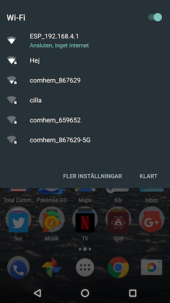
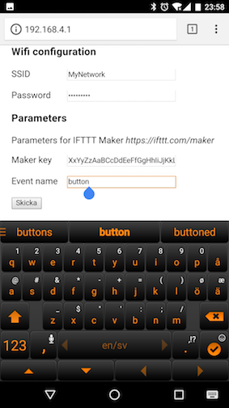

# IFTTTButton
Super simple program for ESP8266: Klick button to call IFTTT.

## Create IFTTT applet
Create an Applet at https://ifttt.com/my_applets with "Maker" as the if. Note your key and event name.

## Build and flash sketch
Open the sketch in the Arduino IDE and check that your settings are OK, specifically the resetPin. Flash the sketch to an ESP8266.

## Config
On the first boot a Wifi Access point called ESP_192.168.4.1 (or similar) is created. Connect to it and go to the ip number in the access point name. Add your configuration for your normal wifi and your IFTTT from above. To reset web config later, connect resetPin (from earlier) to gnd for for 5 sec and restart.

  

## Connect a button
This sketch sends an event everytime device is started, then it goes into deep sleep. Connect a button that will restart the device, for example the reset or CH_PD pin, or cycle the the power.
